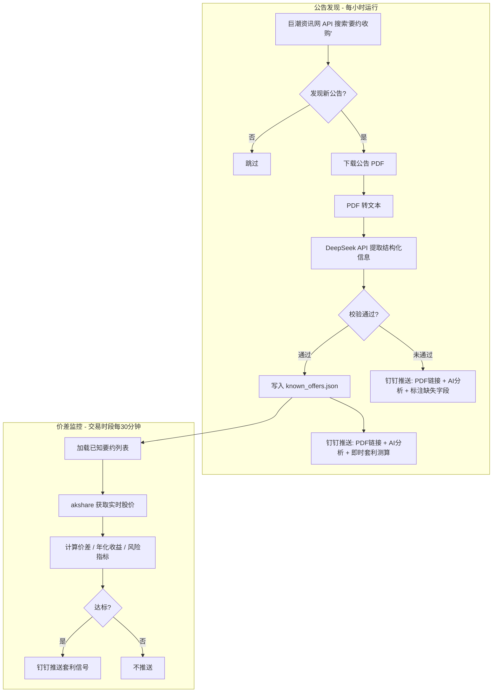

# A 股要约收购套利全自动扫描系统

> 全自动监控要约收购公告、AI 解析要约信息、实时计算套利价差，通过 GitHub Actions 定时运行，钉钉推送公告 PDF + AI 分析 + 套利信号。

## 架构概览



## 要约收购套利原理

### 什么是要约收购

收购方向目标公司全体股东发出公开要约，以**固定价格**在**规定期限**内收购股份。要约价通常高于当前市价，买入股票并在要约期内接受收购即可获得价差收益。

### 核心公式

```
价差收益率 = (要约价 - 当前市价) / 当前市价 × 100%
年化收益率 = 价差收益率 × (365 / 剩余天数)
```

**示例**: 某股票市价 8.50 元，要约价 10.00 元，距截止日 20 天：
- 价差收益率 = (10.00 - 8.50) / 8.50 = **17.6%**
- 年化收益率 = 17.6% × (365 / 20) = **321.5%**

### 要约类型

| 类型 | 说明 | 套利确定性 |
|------|------|-----------|
| **全面要约 + 无条件** | 收购方无条件接纳所有申报股份 | 最高，接近无风险套利 |
| **全面要约 + 有条件** | 设有最低接纳比例等前提条件 | 较高，需关注条件达成情况 |
| **部分要约** | 仅收购一定比例股份，超额部分按比例接纳 | 中等，需估算实际接纳比例 |

### 风险因素与应对

| 风险 | 说明 | 应对策略 |
|------|------|---------|
| **要约失败** | 有条件要约未达标导致失败，股价可能回落 | 关注预受要约进展，评估条件达成概率 |
| **比例接纳** | 部分要约时只有部分股份被接纳 | 按最差接纳比例计算保底收益 |
| **要约撤回** | 收购方撤回要约（极少见但可能） | 关注收购方资金来源与监管审批 |
| **流动性** | 小盘股买入时冲击成本高 | 筛选日均成交额 > 阈值的标的 |
| **时间成本** | 资金占用时间可能较长 | 用年化收益率衡量，设定最低门槛 |

## 技术选型

| 组件 | 技术 | 用途 | 费用 |
|------|------|------|------|
| 语言 | Python 3.11+ | 全部逻辑 | 免费 |
| 实时行情 | akshare | 获取 A 股股价，无需 API Key | 免费 |
| 公告搜索 | 巨潮资讯网 API | 全文检索"要约收购"公告 | 免费 |
| PDF 解析 | pdfplumber | PDF 转文本 | 免费 |
| AI 提取 | DeepSeek API | 从公告文本提取结构化要约信息 | ≈ ¥0.01/次 |
| 定时调度 | GitHub Actions cron | 两个工作流定时运行 | 免费（2000分钟/月） |
| 通知 | 钉钉机器人 Webhook | 推送公告 + 分析 + 套利信号 | 免费 |
| 配置 | YAML + JSON | 阈值参数 + 已知要约记录 | -- |

**每月总成本: 不到 1 元**

## 项目结构

```
stock/
├── .github/
│   └── workflows/
│       ├── discover.yml            # 工作流1: 公告发现 + AI 解析
│       └── monitor.yml             # 工作流2: 价差监控 + 信号推送
├── src/
│   ├── __init__.py
│   ├── discover_main.py            # 入口1: 公告发现流程
│   ├── monitor_main.py             # 入口2: 价差监控流程
│   ├── config.py                   # 配置加载
│   ├── notifier.py                 # 钉钉通知模块
│   ├── announcement.py             # 巨潮公告搜索与 PDF 下载
│   ├── extractor.py                # AI 提取要约信息（DeepSeek）
│   ├── price.py                    # 实时股价获取（akshare）
│   └── strategy.py                 # 套利计算与信号判断
├── config.yml                      # 阈值参数 + 通知配置
├── known_offers.json               # 已知要约记录（自动维护）
├── requirements.txt                # 依赖
└── README.md
```

## 两个 GitHub Actions 工作流

系统拆分为两个独立的工作流，职责清晰，调度频率不同。

### 工作流1: 公告发现 (`discover.yml`)

负责搜索新的要约收购公告，下载 PDF，调用 AI 提取信息，推送钉钉通知。

```yaml
name: Discover Tender Offers

on:
  schedule:
    # 每天早上 9:00 和下午 15:30 各跑一次（北京时间）
    # 对应 UTC 1:00 和 7:30
    - cron: '0 1 * * 1-5'
    - cron: '30 7 * * 1-5'
  workflow_dispatch:

jobs:
  discover:
    runs-on: ubuntu-latest
    steps:
      - uses: actions/checkout@v4

      - uses: actions/setup-python@v5
        with:
          python-version: '3.11'
          cache: 'pip'

      - run: pip install -r requirements.txt

      - run: python src/discover_main.py
        env:
          DINGTALK_WEBHOOK: ${{ secrets.DINGTALK_WEBHOOK }}
          DINGTALK_SECRET: ${{ secrets.DINGTALK_SECRET }}
          DEEPSEEK_API_KEY: ${{ secrets.DEEPSEEK_API_KEY }}

      # 如果发现新公告，自动提交更新后的 known_offers.json
      - name: Commit updated offers
        run: |
          git config user.name "github-actions[bot]"
          git config user.email "github-actions[bot]@users.noreply.github.com"
          git add known_offers.json
          git diff --staged --quiet || git commit -m "auto: update known offers"
          git push
```

**运行频率**: 每个工作日 2 次（开盘前 + 收盘后），每月约 40 次，耗时约 40 分钟。

**关键步骤**: 发现新公告后自动 `git commit` 更新 `known_offers.json`，下次运行时就不会重复处理。

### 工作流2: 价差监控 (`monitor.yml`)

负责加载已知要约列表，获取实时股价，计算套利信号，推送钉钉通知。

```yaml
name: Monitor Tender Offer Spreads

on:
  schedule:
    # 交易时段每 30 分钟运行（北京时间 9:30-15:00）
    # 对应 UTC 1:30-7:00
    - cron: '30 1 * * 1-5'
    - cron: '0,30 2-6 * * 1-5'
    - cron: '0 7 * * 1-5'
  workflow_dispatch:

jobs:
  monitor:
    runs-on: ubuntu-latest
    steps:
      - uses: actions/checkout@v4

      - uses: actions/setup-python@v5
        with:
          python-version: '3.11'
          cache: 'pip'

      - run: pip install -r requirements.txt

      - run: python src/monitor_main.py
        env:
          DINGTALK_WEBHOOK: ${{ secrets.DINGTALK_WEBHOOK }}
          DINGTALK_SECRET: ${{ secrets.DINGTALK_SECRET }}
```

**运行频率**: 交易时段每 30 分钟，每个工作日约 12 次，每月约 240 次，耗时约 240 分钟。

**两个工作流合计**: 约 280 分钟/月，远低于 GitHub Actions 免费额度 2000 分钟。

## 模块详细设计

### 公告搜索模块 (`announcement.py`)

```python
# 调用巨潮资讯网全文检索 API
def search_announcements(keyword="要约收购报告书", days=7):
    url = "http://www.cninfo.com.cn/new/fulltextSearch/full"
    params = {
        "searchkey": keyword,
        "sdate": start_date,
        "edate": today,
        "isfulltext": "false",
        "sortName": "pubdate",
        "sortType": "desc",
        "pageNum": 1,
    }
    resp = requests.post(url, data=params, headers=HEADERS)
    return resp.json()  # 返回公告标题、日期、股票代码、PDF 链接

# 下载公告 PDF 并转为文本
def download_and_extract_text(pdf_url):
    pdf_bytes = requests.get(pdf_url).content
    with pdfplumber.open(BytesIO(pdf_bytes)) as pdf:
        text = "\n".join(page.extract_text() for page in pdf.pages)
    return text
```

### AI 提取模块 (`extractor.py`)

```python
def extract_offer_info(pdf_text: str) -> dict:
    prompt = """你是一个金融文档解析助手。请从以下要约收购报告书中提取关键信息，
严格按照 JSON 格式输出：

{
  "stock_code": "股票代码(6位数字)",
  "stock_name": "股票名称",
  "offer_price": 要约价格(数字,单位元),
  "offer_start": "要约起始日 YYYY-MM-DD",
  "offer_end": "要约截止日 YYYY-MM-DD",
  "type": "full 或 partial",
  "partial_pct": 收购比例上限(数字,全面要约填100),
  "condition": "none 或 min_accept",
  "min_accept_ratio": 最低接纳比例(数字,无条件填0),
  "acquirer": "收购方名称",
  "notes": "一句话总结要约背景"
}

如果某个字段无法确定，填 null。"""

    resp = openai.ChatCompletion.create(
        model="deepseek-chat",
        messages=[
            {"role": "system", "content": prompt},
            {"role": "user", "content": pdf_text[:8000]}  # 截取前 8000 字符
        ],
        base_url="https://api.deepseek.com",
    )
    return json.loads(resp.choices[0].message.content)

# 校验提取结果
def validate_offer(offer: dict) -> tuple[bool, list[str]]:
    errors = []
    if not offer.get("offer_price") or offer["offer_price"] <= 0:
        errors.append("要约价格缺失或无效")
    if not offer.get("offer_end"):
        errors.append("截止日期缺失")
    if offer.get("offer_end") and parse_date(offer["offer_end"]) < today:
        errors.append("截止日期已过期")
    if not offer.get("stock_code") or len(offer["stock_code"]) != 6:
        errors.append("股票代码无效")
    return (len(errors) == 0, errors)
```

### 套利计算模块 (`strategy.py`)

```python
for offer in active_offers:
    days_left = (offer.end_date - today).days
    if days_left <= 0:
        continue

    current_price = get_realtime_price(offer.code)

    # 基础收益
    spread = offer.offer_price - current_price
    spread_pct = spread / current_price * 100
    annualized_pct = spread_pct * (365 / days_left)

    # 部分要约风险调整
    if offer.type == "partial":
        adjusted_spread_pct = spread_pct * (offer.partial_pct / 100)
        adjusted_annualized = adjusted_spread_pct * (365 / days_left)

    # 信号判定
    if spread_pct >= min_spread_pct and annualized_pct >= min_annualized_pct:
        emit(SpreadSignal(...))
    if days_left <= warn_days_left:
        emit(DeadlineWarning(...))
    if spread < 0:
        emit(NegativeSpreadWarning(...))
```

### 钉钉通知模块 (`notifier.py`)

使用签名鉴权方式调用钉钉 Webhook，发送 Markdown 格式消息。

```python
import hmac, hashlib, base64, time, urllib.parse, requests

def send_dingtalk(title: str, markdown_text: str):
    timestamp = str(round(time.time() * 1000))
    string_to_sign = f"{timestamp}\n{DINGTALK_SECRET}"
    hmac_code = hmac.new(
        DINGTALK_SECRET.encode(), string_to_sign.encode(), hashlib.sha256
    ).digest()
    sign = urllib.parse.quote_plus(base64.b64encode(hmac_code))

    url = f"{DINGTALK_WEBHOOK}&timestamp={timestamp}&sign={sign}"
    payload = {
        "msgtype": "markdown",
        "markdown": {"title": title, "text": markdown_text},
    }
    requests.post(url, json=payload)
```

## 钉钉推送消息格式

### 1. 新公告发现（AI 校验通过）

```
【新要约收购公告发现】
━━━━━━━━━━━━━━━━━━

公告信息
股票: 600XXX 某某公司
公告: 《某某公司要约收购报告书摘要》
发布日期: 2026-04-05
公告原文: [点击查看PDF](http://www.cninfo.com.cn/...)

AI 提取分析
要约价格: 10.00 元
要约期限: 2026-04-10 ~ 2026-05-10
要约类型: 全面要约 | 无条件
收购方: 某某集团有限公司
背景: 控股股东拟将持股比例从51%提升至75%

实时套利测算
当前股价: 8.50 元
价差: +1.50 元 (17.6%)
年化收益: 189.3% (剩余34天)
日均成交额: 2,340 万元

AI 置信度: 高 - 所有字段校验通过，已自动加入监控
━━━━━━━━━━━━━━━━━━
```

### 2. 新公告发现（AI 校验未通过）

```
【新要约收购公告 - 需人工确认】
━━━━━━━━━━━━━━━━━━

公告: 《某某公司要约收购报告书摘要》
公告原文: [点击查看PDF](http://www.cninfo.com.cn/...)

AI 提取结果
要约价格: 10.00 元
截止日期: [未能提取]
要约类型: 部分要约

缺失字段: 截止日期
请查看 PDF 原文确认
━━━━━━━━━━━━━━━━━━
```

### 3. 日常套利信号

```
【要约收购套利信号】
━━━━━━━━━━━━━━━━━━
股票: 600XXX 某某公司
现价: 8.50 | 要约价: 10.00
价差: +1.50 元 (17.6%)
年化: 321.5%
类型: 全面要约 | 无条件
截止: 2026-05-10 (剩余24天)
━━━━━━━━━━━━━━━━━━
```

### 4. 截止日提醒

```
【要约即将截止提醒】
━━━━━━━━━━━━━━━━━━
股票: 000XXX 某某公司
要约价: 15.50 | 现价: 14.20
剩余: 3 天 (2026-04-20 截止)
当前价差: 9.2% | 年化: 1117.3%
请尽快决策是否参与!
━━━━━━━━━━━━━━━━━━
```

## 配置文件 (`config.yml`)

```yaml
# 信号过滤阈值
thresholds:
  min_spread_pct: 3.0              # 最小价差收益率(%)
  min_annualized_pct: 30.0         # 最小年化收益率(%)
  warn_days_left: 5                # 截止提醒天数
  min_daily_volume: 500            # 最小日均成交额(万元)

# 公告搜索配置
announcement:
  keyword: "要约收购报告书"
  search_days: 7                   # 搜索最近 N 天的公告

# AI 提取配置
extractor:
  model: "deepseek-chat"
  base_url: "https://api.deepseek.com"
  max_text_length: 8000            # PDF 文本截取长度
  # DEEPSEEK_API_KEY 从环境变量读取

# 通知配置
notification:
  dingtalk:
    enabled: true
    # DINGTALK_WEBHOOK 和 DINGTALK_SECRET 从环境变量读取
```

## 已知要约记录 (`known_offers.json`)

由程序自动维护，记录所有已发现的要约收购，避免重复处理。

```json
{
  "offers": [
    {
      "announcement_id": "cninfo_20260405_600XXX",
      "stock_code": "600XXX",
      "stock_name": "某某公司",
      "offer_price": 10.00,
      "offer_start": "2026-04-10",
      "offer_end": "2026-05-10",
      "type": "full",
      "condition": "none",
      "min_accept_ratio": 0,
      "partial_pct": 100,
      "acquirer": "某某集团",
      "notes": "控股股东拟提升持股至75%",
      "pdf_url": "http://www.cninfo.com.cn/...",
      "discovered_at": "2026-04-05T09:00:00",
      "ai_validated": true,
      "status": "active"
    }
  ],
  "last_search_time": "2026-04-06T09:00:00"
}
```

**字段 `status` 的生命周期**: `active`（进行中）→ `expired`（已到期，自动标记）

## GitHub Secrets 配置

在 GitHub 仓库的 Settings → Secrets and variables → Actions 中添加以下三个 Secret:

| Secret 名 | 值 | 获取方式 |
|-----------|-----|---------|
| `DINGTALK_WEBHOOK` | `https://oapi.dingtalk.com/robot/send?access_token=xxx` | 钉钉群 → 群设置 → 智能群助手 → 添加自定义机器人 |
| `DINGTALK_SECRET` | `SECxxxxxxxx` | 创建机器人时选"加签"获得 |
| `DEEPSEEK_API_KEY` | `sk-xxxxxxxx` | [platform.deepseek.com](https://platform.deepseek.com) 注册获取 |

## 实施步骤

| 步骤 | 任务 | 说明 |
|------|------|------|
| 1 | 初始化项目 | 创建目录结构、`requirements.txt`（akshare, requests, pyyaml, pdfplumber, openai）、`config.yml`、空 `known_offers.json` |
| 2 | 配置加载模块 | `config.py` -- 读取 YAML 配置 + JSON 要约记录 |
| 3 | 公告搜索模块 | `announcement.py` -- 巨潮 API 全文检索 + PDF 下载 + PDF 转文本 |
| 4 | AI 提取模块 | `extractor.py` -- DeepSeek API 调用 + JSON 解析 + 字段校验 |
| 5 | 股价获取模块 | `price.py` -- akshare 实时股价 + 异常处理与重试 |
| 6 | 套利策略模块 | `strategy.py` -- 价差/年化收益计算 + 部分要约调整 + 三种信号判定 |
| 7 | 钉钉通知模块 | `notifier.py` -- 签名鉴权 + 四种 Markdown 消息模板 |
| 8 | 公告发现入口 | `discover_main.py` -- 搜索 → 下载 → AI 提取 → 校验 → 保存 → 通知 |
| 9 | 价差监控入口 | `monitor_main.py` -- 加载要约 → 获取股价 → 计算信号 → 通知 |
| 10 | GitHub Actions | `discover.yml`（每日2次）+ `monitor.yml`（交易时段每30分钟） |
| 11 | README | 使用说明、Secrets 配置教程、DeepSeek 注册指引、常见问题 |

## 注意事项

- **GitHub Actions 用量**: 两个工作流合计约 280 分钟/月，在免费额度（2000 分钟）内
- **AI 费用**: DeepSeek 每次提取 ≈ ¥0.01，每月 ≈ ¥0.05-0.15，几乎可忽略
- **数据延迟**: akshare 行情有数分钟延迟，对日级别策略完全够用
- **节假日处理**: 通过 akshare 交易日历判断，休市日跳过执行
- **巨潮反爬**: 设置合理的 User-Agent 和请求间隔，每天仅 2 次检索不会触发限制
- **AI 可靠性**: 校验失败自动降级为人工确认，不会产生错误的套利信号
- **Git 自动提交**: `discover.yml` 会自动提交 `known_offers.json` 的更新，需在仓库 Settings → Actions → General 中开启 "Read and write permissions"
